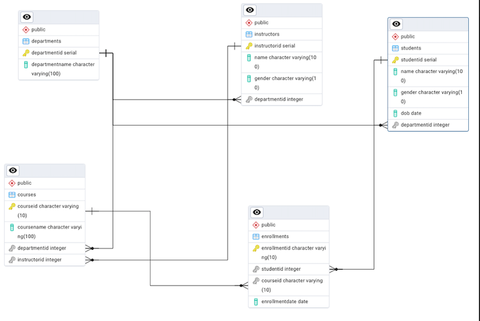

# Student_Management_System
## Objective
The primary objective of this project is to design and create a relational database for a Student Management System (SMS) using SQL. The database will efficiently store and manage data on students, courses, instructors, and enrollments, enabling users to perform key administrative functions such as adding students, assigning courses, and generating dynamic reports through SQL queries.

## Entities (Tables)
1.	Students
Primary Key: StudentID

Fields: Name, Gender, Date of Birth (DOB), DepartmentID

Purpose: Contains details about each student and links them to a specific department.


2.	Departments
Primary Key: DepartmentID

Fields: DepartmentName
Purpose: Holds information about various departments within the institution.


3.	Courses
Primary Key: CourseID

Fields: CourseName, DepartmentID

Purpose: Stores details of courses, with each course associated with one department.


4.	Enrollments
Primary Key: EnrollmentID

Fields: StudentID, CourseID, EnrollmentDate

Purpose: Records which students are enrolled in which courses and when, representing the many-to-many relationship between students and courses.


5.	Instructors
Primary Key: InstructorID

Fields: Name, Gender, DOB, DepartmentID, Phone

Purpose: Maintains instructor information, with each instructor linked to a department.

## Relationships 
- One Department has many Students
- One Department offers many Courses
- One Student can enroll in many Courses (many-to-many via Enrollments)

## Entity Relationship Diagram 

## Relationships
-	Students to Departments
Each student belongs to one department (many students to one department).

The DepartmentID in the Students table is a foreign key referencing the Departments table.


- Courses to Departments
Each course is assigned to one department (many courses to one department).

The DepartmentID in the Courses table references the Departments table.


- Enrollments link Students and Courses
There is a many-to-many relationship between students and courses, managed through the Enrollments table.

StudentID in Enrollments references Students, and CourseID references Courses.


-	Instructors to Departments
Each instructor belongs to a single department (many instructors to one department).

The DepartmentID in the Instructors table refers to Departments.


## Overall Structure
The Departments table acts as a central entity connecting to Students, Courses, and Instructors through one-to-many relationships.

The Enrollments table bridges Students and Courses, effectively modeling their many-to-many relationship.

Foreign key constraints ensure consistency and integrity across these relationships.


